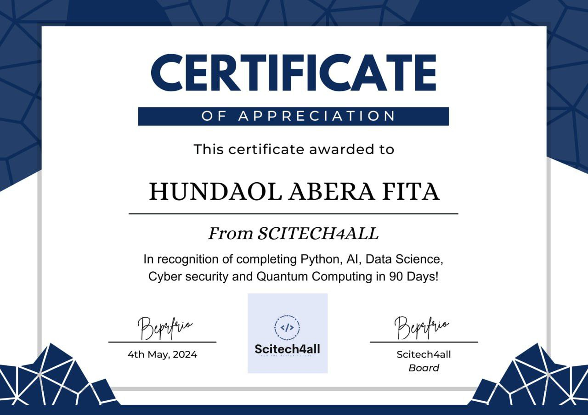

# Hundaol Abera Fita - Developer Portfolio

Welcome to my developer portfolio! This project is a showcase of my journey as a programmer, highlighting my skills, projects, certifications, and contact information.

## Table of Contents
- [Introduction](#introduction)
- [About Me](#about-me)
- [My Projects](#my-projects)
- [Certifications](#certifications)
- [Contact Me](#contact-me)
- [Technologies Used](#technologies-used)
- [Installation](#installation)

## Introduction

Thank you for visiting my portfolio. I am passionate about programming, technology, and making a difference through innovation.

## About Me

Hello! I'm **Hundaol Abera Fita**, a passionate programmer from Modjo, Ethiopia. I completed my elementary education at **Glorious Primary School**, where I was recognized for my exceptional performance in national exams. This achievement opened the door for me to attend **Oromia Development Association Boarding School**, where I learned to live independently and formed meaningful connections with my peers.

My journey into programming began with the **Addis Coder** program, where I discovered my potential as a developer. I still remember the excitement of writing my first line of code—`print("Hello, world!")`—which sparked my curiosity to learn more about algorithms and data structures. Along with a group of like-minded students, I co-founded **Addis Coder Spark**, aimed at inspiring and encouraging young students to explore coding and technology.

### Personal Information
- **Location:** Modjo, Ethiopia
- **Age:** 17
- **Nationality:** Ethiopian
- **Study:** ODA SBS
- **Grade:** 11
- **Interests:** Coding, studying, chess

## My Projects

### Self-Farming and Harvesting Tractor

The idea for this project originated from the challenges faced by Ethiopian farmers in farming and harvesting their products. Agriculture is the backbone of Ethiopia, with 85% of the population dependent on it. Many farmers struggle with outdated methods, making it difficult to increase their yield. To address this issue, I developed a self-farming and harvesting tractor aimed at modernizing farming practices.

### Responsive Portfolio Website

This responsive website serves as my digital portfolio, showcasing my skills, projects, and certifications. It is designed using HTML, CSS, and Bootstrap, ensuring a seamless user experience across different devices.

## Certifications

### Certificate of Excellence

Awarded for having the highest score in the grade 8 ministry examination.

### Python Data Structures and Algorithms

Completed the course on Python Data Structures and Algorithms from Mindluster E-learning platform.

### Regional Mathematics Competition Winner

Recognized for winning a competition held in the Oromia region, achieving 1st place.

### Volunteer Teaching Certificate

Volunteered at Modjo Evangelical Church, teaching subjects like mathematics, English, and science.

### SciTech4All Participation

Certified for participating in SciTech4All, where I learned Python, quantum computing, AI, data science, and cybersecurity.

### National Mathematics Competition Certificate

Received recognition for achieving a great score in the Mysorobom National Mathematics Competition.

## Contact Me

Feel free to reach out if you have any questions or would like to connect!

- **Name:** Hundaol Abera Fita
- **Email:** [your-email@example.com](mailto:your-email@example.com)

## Technologies Used

- HTML
- CSS
- Bootstrap
- JavaScript (for future enhancements)

## Installation

To view this project locally, clone the repository and open the `index.html` file in your web browser.

```bash
git clone https://github.com/yourusername/your-repo-name.git
cd your-repo-name
open index.html
